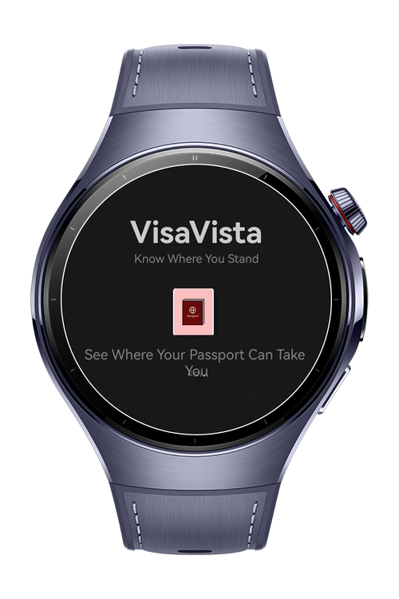
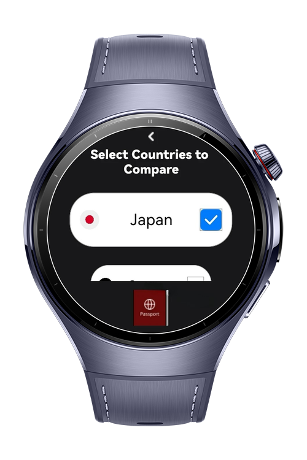
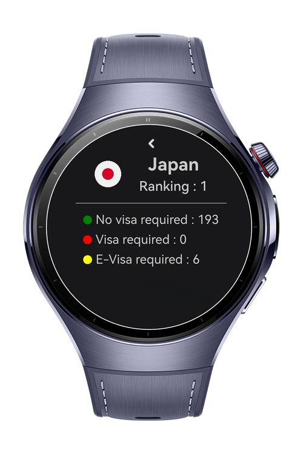
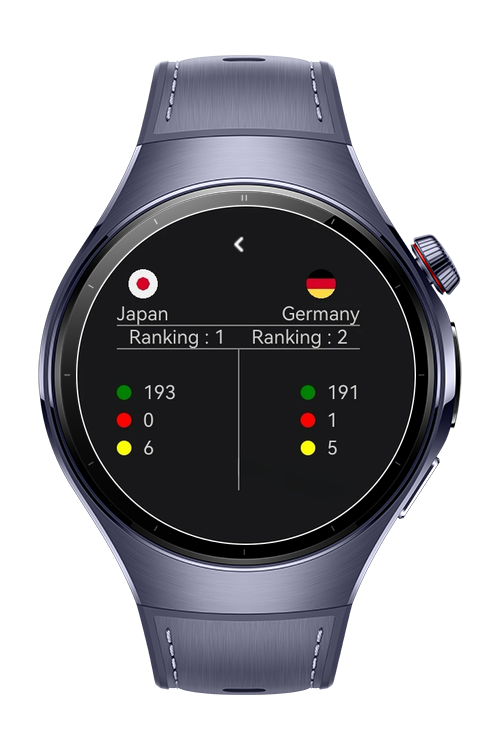

> **Note:** To access all shared projects, get information about environment setup, and view other guides, please visit [Explore-In-HMOS-Wearable Index](https://github.com/Explore-In-HMOS-Wearable/hmos-index).

# VisaVista App

VisaVista is a HarmonyOS-based ArkTS application that enables users to explore and compare visa requirements, passport rankings, and travel privileges across different countries.

# Preview

<div>  
    
    
    
    
</div>  


# Use Cases

- Travelers comparing passport privileges before applying for visas
- Students or researchers analyzing global mobility trends
- Governments and embassies providing digital visa advisory services


# Tech Stack

- **Language**: ArkTS
- **Framework**: HarmonyOS ArkUI
- **Libraries**: Navigation Kit, ArkUI Kit
- **Tools**: DevEco Studio, Simulator, Huawei Watch 5 real device


# Directory Structure

```
entry/
├── src/
│   ├── main/
│   │   ├── ets/
│   │   │   ├── pages/
│   │   │   │   ├── WelcomePage.ets
│   │   │   │   ├── VisaPage.ets
│   │   │   │   ├── VisaDetailPage.ets
│   │   │   │   └── ComparisonPage.ets
│   │   │   └── model/
│   │   │       └── CountrySelectionModel.ets
│   │   ├── resources/
│   │   │   ├── rawfile/
│   │   │   │   └── visaData.json
│   │   │   └── media/
│   │   │       ├── turkey.png
│   │   │       ├── germany.png
│   │   │       ├── united_states.png
│   │   │       └── argentina.png
├────────────

```

# Constraints and Restrictions

## Supported Device

- Huawei Watch 5

# License

VisaVista is distributed under the terms of the MIT License. <br/>
See the [LICENCE](/LICENCE) for more information.
